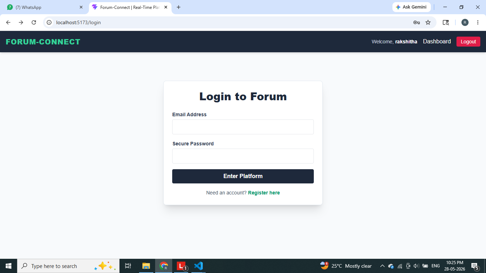
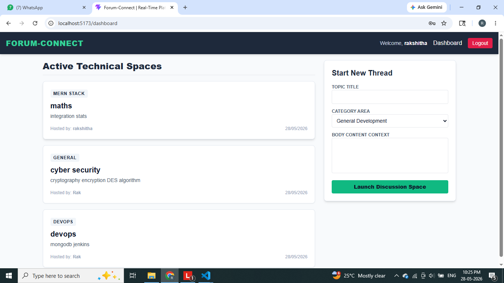
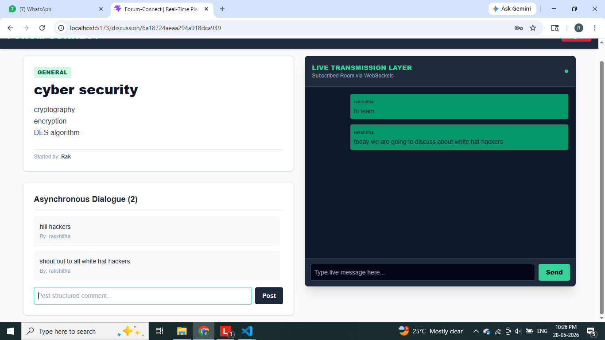

# 🚀 CommunityHub – Modern Forum & Real-Time Chat Platform

<p align="center">
A scalable community platform that combines the power of discussion forums and real-time communication into a single application.
</p>

<p align="center">
Built with <b>Next.js</b>, <b>NestJS</b>, <b>PostgreSQL</b>, <b>Socket.IO</b>, <b>Redis</b>, <b>Prisma</b>, <b>Meilisearch</b>, and <b>BullMQ</b>.
</p>

---

## 📌 Project Overview

CommunityHub is a production-inspired full-stack application designed to bring together asynchronous discussions and real-time collaboration.

The platform allows users to create posts, participate in threaded discussions, communicate through live chat channels and direct messages, receive notifications, and discover content using a powerful search engine.

This project demonstrates modern software engineering practices including scalable architecture, real-time communication, role-based authorization, background job processing, moderation workflows, and containerized deployment.

---

## ✨ Key Features

### 🔐 Authentication & Authorization

* JWT-based Authentication
* Secure Password Hashing
* Role-Based Access Control
* Admin, Moderator, and Member Roles

### 📝 Discussion Forum

* Categories & Tags
* Rich Markdown Posts
* Threaded Comments & Replies
* Voting System
* Bookmarks
* Content Discovery

### 💬 Real-Time Communication

* Public Chat Channels
* Direct Messaging
* Online Presence Tracking
* Typing Indicators
* Instant Message Delivery

### 🔔 Notifications

* Mentions
* Replies
* Direct Messages
* System Alerts

### 🔎 Search Engine

* Powered by Meilisearch
* Fast Full-Text Search
* Post Discovery
* Content Indexing

### 🛡️ Moderation System

* Content Flagging
* Moderator Review Queue
* Content Approval Workflow
* Community Safety Controls

### ⚙️ Background Processing

* Daily Digest Generation
* Notification Processing
* Moderation Queue Handling
* Scheduled Jobs using BullMQ

### 🐳 DevOps & Deployment

* Dockerized Services
* PostgreSQL Database
* Redis Pub/Sub
* Scalable Architecture
* Production-Oriented Design

---

## 🏗️ System Architecture

```text
                    ┌─────────────────┐
                    │    Next.js UI   │
                    └────────┬────────┘
                             │
                             ▼
                    ┌─────────────────┐
                    │   NestJS API    │
                    └────────┬────────┘
                             │
              ┌──────────────┼──────────────┐
              ▼              ▼              ▼

      PostgreSQL       Meilisearch       BullMQ
       + Prisma          Search        Background Jobs

                             │
                             ▼

                    Socket.IO Server
                             │
                             ▼
                           Redis
                  (Pub/Sub & Presence)
```

---

## 🛠️ Tech Stack

| Category        | Technologies                 |
| --------------- | ---------------------------- |
| Frontend        | Next.js, React, Tailwind CSS |
| Backend         | NestJS, TypeScript           |
| Database        | PostgreSQL                   |
| ORM             | Prisma                       |
| Real-Time       | Socket.IO                    |
| Cache & Pub/Sub | Redis                        |
| Search          | Meilisearch                  |
| Jobs            | BullMQ                       |
| Security        | JWT, bcrypt, Helmet          |
| Deployment      | Docker, Docker Compose       |

---

## 🎯 What I Learned

Through this project, I gained practical experience in:

* Designing scalable backend architectures
* Building real-time applications
* Implementing authentication and authorization
* Database modeling with Prisma
* Search engine integration
* Background job processing
* Community moderation systems
* Docker-based deployment workflows
* Full-stack application development

---

## 🚀 Future Improvements

* Voice & Video Channels
* AI-Powered Content Moderation
* Mobile Application
* Push Notifications
* Analytics Dashboard
* Multi-Language Support

---

## 📷 Screenshots

### Login Page 
 
### Dashboard 
 
### Dashboard 


---

🎥 Project Demo Video
📌 Watch Full Project Demo

Google Drive Video Link:
https://drive.google.com/file/d/1Ty4Hor1Zo2NO8AEiftgItSi7Q99SMkUS/view?usp=drive_link

---

## 👨‍💻 Author

**Rakshitha A S**

Cyber Security Engineering Student


---

⭐ If you found this project interesting, consider giving it a star!
